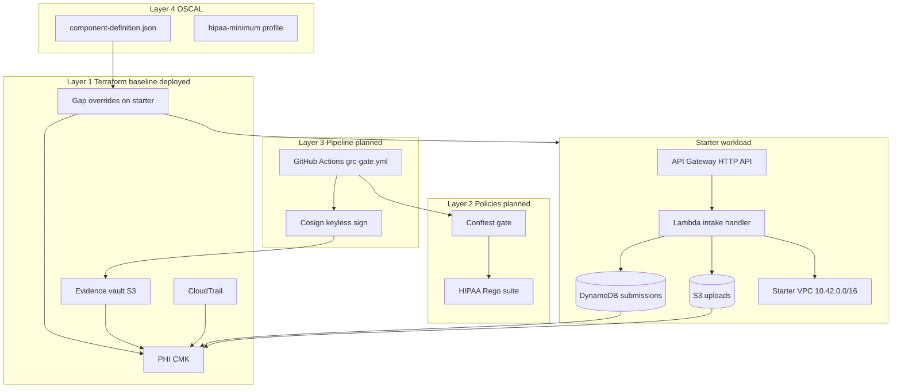
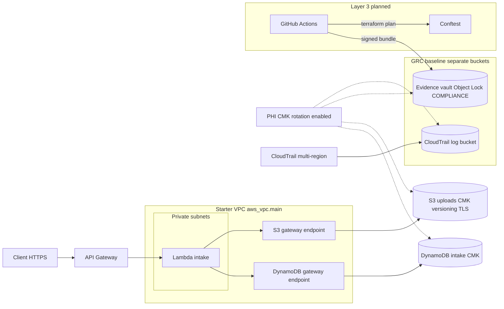

# Capstone Write-Up: Acme Health Patient Intake API

**Primary framework:** HIPAA Security Rule

Acme Health is a telehealth company handling PHI through the Patient Intake API. This repository wraps the intentionally non-compliant starter workload with a GRC baseline (Terraform), OPA policy suite, GitHub Actions evidence pipeline, and OSCAL component. HIPAA is the declared primary framework because the workload processes patient intake data; every policy cites HIPAA Technical Safeguard sections, and OSCAL maps implementations to those controls.

---

## Architecture

### Four layers (capstone model)

The repo integrates four layers around a single AWS workload in `us-east-1`. Layer 1 is deployed; Layers 2–4 are the next build phases.

### AWS topology (Layer 1 + starter)

Patient traffic enters through API Gateway. The Lambda runs in the **starter's existing VPC** (private subnets), reaching DynamoDB and the uploads bucket via **VPC gateway endpoints** (no NAT gateway). All PHI data stores and audit artifacts encrypt with a **single customer-managed KMS key**. CloudTrail captures management API activity to a dedicated log bucket. The evidence vault is separate from workload buckets and holds pipeline artifacts under **COMPLIANCE Object Lock**.

### Data and evidence flows

| Flow | Path | HIPAA tie-in |
|---|---|---|
| **Intake (PHI)** | Client → API Gateway → Lambda → DynamoDB + S3 uploads | 164.312(a)(2)(iv) encryption at rest, 164.312(e)(1) TLS in transit |
| **Encryption** | CMK wraps uploads bucket, DynamoDB table, evidence vault, CloudTrail logs | Customer custody of keys |
| **Management audit** | AWS API calls → CloudTrail → trail S3 bucket (log file validation) | 164.312(b) audit controls |
| **Pipeline evidence (planned)** | PR merge → plan + policy check → apply → Cosign → evidence vault | Chain of custody for IaC compliance proof |

### Terraform file map

| File | Role |
|---|---|
| `main.tf` | Starter workload (VPC, Lambda, API, DynamoDB, S3) + in-place gap fixes (DDB CMK, Lambda VPC, IAM) |
| `grc_kms.tf` | Customer-managed KMS key with rotation |
| `grc_vault.tf` | Evidence vault (Object Lock COMPLIANCE, SSE-KMS) |
| `grc_cloudtrail.tf` | Multi-region CloudTrail + dedicated log bucket |
| `grc_gap_overrides.tf` | Companion fixes on starter resources (S3 KMS, versioning, TLS policy, VPC endpoints, Lambda SG) |
| `grc_outputs.tf` | ARNs and bucket names for pipeline and OSCAL |

---

## Design decisions

### Evidence vault Object Lock: COMPLIANCE mode

**What we built:** The evidence vault (`grc_vault.tf`) uses S3 Object Lock in **COMPLIANCE** mode with a 30-day default retention period, versioning enabled, and SSE-KMS encryption with a customer-managed key.

**Why COMPLIANCE:** HIPAA **164.312(b)** (Audit Controls) requires the ability to record and examine activity in systems that contain or use PHI. For infrastructure-as-code evidence (Terraform plans, policy results, signed bundles), auditors need confidence that records were not altered or deleted before their retention period ends. COMPLIANCE mode provides that guarantee: no principal, including the account root, can shorten retention or delete an object until the lock expires. That is the same immutability expectation enterprise customers and regulators apply to audit logs and compliance artifacts.

**Why not GOVERNANCE:** GOVERNANCE mode allows users with `s3:BypassGovernanceRetention` to override locks. That is acceptable for personal sandbox experimentation but weakens the chain-of-custody story. Because this capstone declares HIPAA as the primary framework and the evidence pipeline is a core deliverable, I chose COMPLIANCE to demonstrate the control as it would be implemented for PHI-adjacent audit evidence in production.

**Trade-off accepted:** COMPLIANCE is less forgiving during development. Mis-uploaded or test bundles remain locked for the full retention window (30 days by default). That operational friction is intentional: it mirrors what a GRC engineer accepts when standing up a real evidence vault for a regulated workload. I wanted to be as realistic as possible with the development. 

---

## Control coverage

| Gap | HIPAA control | Terraform fix | Rego policy |
|---|---|---|---|
| GAP-01 SSE-KMS on uploads | 164.312(a)(2)(iv) | `grc_gap_overrides.tf` | `hipaa_s3_kms.rego` |
| GAP-02 DynamoDB CMK | 164.312(a)(2)(iv) | `main.tf` | `hipaa_dynamodb_kms.rego` |
| GAP-03 TLS-only S3 | 164.312(e)(1) | `grc_gap_overrides.tf` | `hipaa_s3_tls.rego` |
| GAP-04 S3 versioning | 164.308(a)(7) | `grc_gap_overrides.tf` | `hipaa_s3_versioning.rego` |
| GAP-05 Lambda in VPC | 164.312(e)(1) | `main.tf` + `grc_gap_overrides.tf` | `hipaa_lambda_vpc.rego` |
| GAP-07 Least privilege IAM | 164.312(a)(1) | `main.tf` | `hipaa_least_privilege.rego` |
| GAP-06 DLQ / X-Ray | SOC 2 CC7.2 | Not implemented | — |
| GAP-08 API logging / WAF | 164.312(b) | Not implemented | — |

All six Rego policies live under `policies/` with pass/fail fixtures in `policies/tests/`. Run `opa test ./policies -v` locally.

---

## Trade-offs and honest gaps

*(To be completed.)*

---

## Next sprint

*(To be completed.)*
