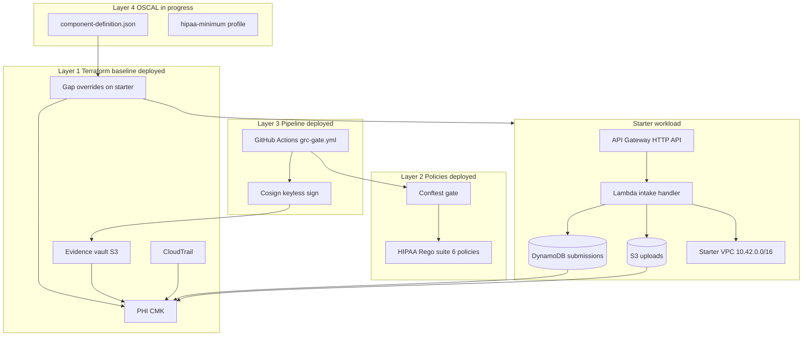
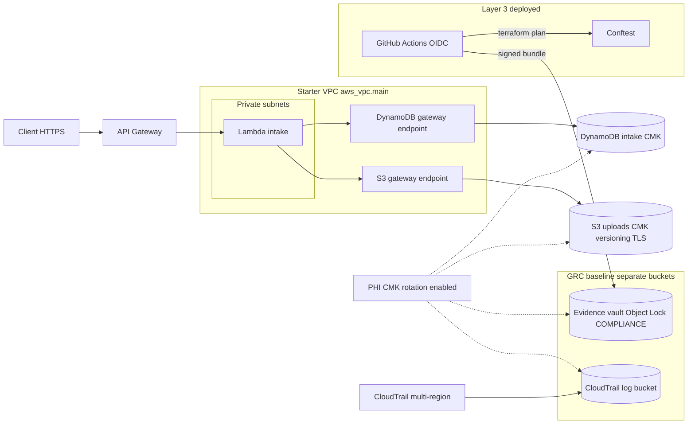

# Capstone Write-Up: Acme Health Patient Intake API

**Primary framework:** HIPAA Security Rule

Acme Health is a telehealth company handling PHI through the Patient Intake API. This repository wraps the intentionally non-compliant starter workload with a GRC baseline (Terraform), OPA policy suite, GitHub Actions evidence pipeline, and OSCAL component. HIPAA is the declared primary framework because the workload processes patient intake data; every policy cites HIPAA Technical Safeguard sections, and OSCAL maps implementations to those controls.

**Deployment:** `us-east-1`, personal sandbox account, fork at [tiffanymwr15/cgep-app-starter](https://github.com/tiffanymwr15/cgep-app-starter). Layers 1–3 are deployed and demonstrated in CI. Layer 4 (OSCAL) is the remaining deliverable.

---

## Architecture

### Four layers (capstone model)

The repo integrates four layers around a single AWS workload in `us-east-1`. Layers 1–3 are deployed; Layer 4 (OSCAL) documents the traceability chain for graders and auditors.



### AWS topology (Layer 1 + starter)

Patient traffic enters through API Gateway. The Lambda runs in the **starter's existing VPC** (private subnets), reaching DynamoDB and the uploads bucket via **VPC gateway endpoints** (no NAT gateway). All PHI data stores and audit artifacts encrypt with a **single customer-managed KMS key**. CloudTrail captures management API activity to a dedicated log bucket. The evidence vault is separate from workload buckets and holds pipeline artifacts under **COMPLIANCE Object Lock**.



### Data and evidence flows

| Flow | Path | HIPAA tie-in |
|---|---|---|
| **Intake (PHI)** | Client → API Gateway → Lambda → DynamoDB + S3 uploads | 164.312(a)(2)(iv) encryption at rest, 164.312(e)(1) TLS in transit |
| **Encryption** | CMK wraps uploads bucket, DynamoDB table, evidence vault, CloudTrail logs | Customer custody of keys |
| **Management audit** | AWS API calls → CloudTrail → trail S3 bucket (log file validation) | 164.312(b) audit controls |
| **Pipeline evidence** | PR: plan + policy → merge: plan + policy + apply + Cosign → `runs/<RUN_ID>/` in evidence vault | Chain of custody for IaC compliance proof (164.312(b)) |

### Terraform file map

| File | Role |
|---|---|
| `main.tf` | Starter workload (VPC, Lambda, API, DynamoDB, S3) + in-place gap fixes (DDB CMK, Lambda VPC, IAM) |
| `grc_kms.tf` | Customer-managed KMS key with rotation |
| `grc_vault.tf` | Evidence vault (Object Lock COMPLIANCE, SSE-KMS) |
| `grc_cloudtrail.tf` | Multi-region CloudTrail + dedicated log bucket |
| `grc_gap_overrides.tf` | Companion fixes on starter resources (S3 KMS, versioning, TLS policy, VPC endpoints, Lambda SG) |
| `grc_outputs.tf` | ARNs and bucket names for pipeline and OSCAL |
| `backend.tf` | S3 remote state (required for CI runners) |
| `oidc/` | GitHub Actions OIDC provider + `cgep-grc-gate` IAM role |

---

## Evidence pipeline (Layer 3)

Workflow: [`.github/workflows/grc-gate.yml`](.github/workflows/grc-gate.yml). GitHub Actions assumes the `cgep-grc-gate` IAM role via OIDC (no long-lived AWS keys). Terraform state lives in S3 (`terraform/backend.tf`) so PR and main jobs plan against the same infrastructure.

### Five-step gate

| Step | PR (`plan-and-policy`) | Main (`plan-apply-sign-upload`) |
|---|---|---|
| 1. Plan | yes | yes |
| 2. Policy check (Conftest) | yes | yes |
| 3. Apply | no | yes |
| 4. Sign (Cosign keyless) | no | yes |
| 5. Upload to vault | no | yes |

PR jobs are **fail-closed**: a policy violation blocks merge. Main jobs only run after merge to `main`.

### Demonstrated runs

| Event | PR / run | Result |
|---|---|---|
| Green PR (remote state + OIDC fix) | [PR #1](https://github.com/tiffanymwr15/cgep-app-starter/pull/1) · [run 27923814905](https://github.com/tiffanymwr15/cgep-app-starter/actions/runs/27923814905) | `plan-and-policy` passed |
| Merge to main (full pipeline) | [run 27923873028](https://github.com/tiffanymwr15/cgep-app-starter/actions/runs/27923873028) | Plan, policy, apply, sign, vault upload |
| Red PR (GAP-01 re-introduced) | [PR #2](https://github.com/tiffanymwr15/cgep-app-starter/pull/2) · closed without merge | `plan-and-policy` **failed** on `hipaa_s3_kms.rego` |

Evidence vault: `acme-health-intake-grc-evidence-vault-f88cc5df`. Main-run artifacts live under `s3://acme-health-intake-grc-evidence-vault-f88cc5df/runs/27923873028/` (bundle, SHA-256 sidecar, Cosign bundle, `receipt.json`).

Verify locally:

```bash
bash scripts/verify-evidence.sh 27923873028 \
  --vault acme-health-intake-grc-evidence-vault-f88cc5df \
  --profile capstone-deploy-user
```

Policy gate locally: `bash scripts/policy-gate.sh` (after `terraform plan -out=tfplan && terraform show -json tfplan > plan.json`).

---

## Design decisions

### Evidence vault Object Lock: COMPLIANCE mode

**What we built:** The evidence vault (`grc_vault.tf`) uses S3 Object Lock in **COMPLIANCE** mode with a 30-day default retention period, versioning enabled, and SSE-KMS encryption with a customer-managed key.

**Why COMPLIANCE:** HIPAA **164.312(b)** (Audit Controls) requires the ability to record and examine activity in systems that contain or use PHI. For infrastructure-as-code evidence (Terraform plans, policy results, signed bundles), auditors need confidence that records were not altered or deleted before their retention period ends. COMPLIANCE mode provides that guarantee: no principal, including the account root, can shorten retention or delete an object until the lock expires. That is the same immutability expectation enterprise customers and regulators apply to audit logs and compliance artifacts.

**Why not GOVERNANCE:** GOVERNANCE mode allows users with `s3:BypassGovernanceRetention` to override locks. That is acceptable for personal sandbox experimentation but weakens the chain-of-custody story. Because this capstone declares HIPAA as the primary framework and the evidence pipeline is a core deliverable, I chose COMPLIANCE to demonstrate the control as it would be implemented for PHI-adjacent audit evidence in production.

**Trade-off accepted:** COMPLIANCE is less forgiving during development. Mis-uploaded or test bundles remain locked for the full retention window (30 days by default). That operational friction is intentional: it mirrors what a GRC engineer accepts when standing up a real evidence vault for a regulated workload. I wanted to be as realistic as possible with the development. 

---

## Control coverage

| Gap | HIPAA control | Terraform fix | Rego policy |
|---|---|---|---|
| GAP-01 SSE-KMS on uploads | 164.312(a)(2)(iv) | `grc_gap_overrides.tf` | `hipaa_s3_kms.rego` |
| GAP-02 DynamoDB CMK | 164.312(a)(2)(iv) | `main.tf` | `hipaa_dynamodb_kms.rego` |
| GAP-03 TLS-only S3 | 164.312(e)(1) | `grc_gap_overrides.tf` | `hipaa_s3_tls.rego` |
| GAP-04 S3 versioning | 164.308(a)(7) | `grc_gap_overrides.tf` | `hipaa_s3_versioning.rego` |
| GAP-05 Lambda in VPC | 164.312(e)(1) | `main.tf` + `grc_gap_overrides.tf` | `hipaa_lambda_vpc.rego` |
| GAP-07 Least privilege IAM | 164.312(a)(1) | `main.tf` | `hipaa_least_privilege.rego` |
| GAP-06 DLQ / X-Ray | SOC 2 CC7.2 | Not implemented | — |
| GAP-08 API logging / WAF | 164.312(b) | Not implemented | — |

All six Rego policies live under `policies/` with pass/fail fixtures in `policies/tests/`. Run `opa test ./policies -v` locally.

---

## Trade-offs and honest gaps

### Three-layer defense for six gaps

For GAP-01 through GAP-05 and GAP-07, I used all three capstone layers where applicable: Terraform override, Rego policy that fails the plan if the gap returns, and (in progress) OSCAL `implemented-requirement` entries linking Terraform resources, policies, and pipeline evidence. PR #2 demonstrates the policy layer: changing uploads SSE from `aws:kms` to `AES256` failed CI with a HIPAA citation before any apply could run.

### GAP-06 and GAP-08 (not implemented)

| Gap | Why deferred | Risk accepted |
|---|---|---|
| **GAP-06** (no DLQ, X-Ray, reserved concurrency) | Observability and resilience gaps are real but secondary to encryption, network boundary, and IAM for a minimal intake API in a sandbox. | Failed Lambda invocations are not automatically retried or traced; harder to debug production incidents. |
| **GAP-08** (no API access logs, throttling, WAF) | CloudTrail covers **management** API activity; it does not log **data-plane** HTTP requests to API Gateway. Full fix needs access log destination, stage settings, and likely WAF in front of the HTTP API. | Cannot reconstruct per-request intake audit trail from AWS logs alone; no WAF rate limiting or OWASP rule set. |

These are documented as open items in the control coverage table and will appear as `planned` or `partial` in the OSCAL component. I did not claim them as closed in Terraform or Rego.

### CI IAM role: `AdministratorAccess` (sandbox only)

The `cgep-grc-gate` OIDC role attaches `AdministratorAccess` so `terraform apply` in CI can manage the full stack without hand-tuning hundreds of IAM actions. A separate inline policy scopes **vault writes** to `runs/*` on the evidence bucket (defense in depth). In production I would replace the managed policy with a least-privilege policy generated from planned IAM actions, or use separate plan/apply roles with approval gates.

### VPC endpoints instead of NAT

Lambda runs in **private subnets** with **S3 and DynamoDB gateway endpoints** instead of a NAT gateway. That keeps monthly cost near zero for a lab but means the function cannot reach the public internet directly from the VPC. Acceptable for this workload (AWS API access via endpoints only); unacceptable if the handler needed external HTTPS calls without adding NAT or a VPC-attached egress path.

### Single PHI CMK

One customer-managed key encrypts uploads, DynamoDB, the evidence vault, and CloudTrail logs. Simplifies key policy and audit narrative for a capstone; production might split keys by data class (PHI vs audit vs operational) for blast-radius isolation.

### COMPLIANCE Object Lock friction

Already discussed above: mis-uploaded evidence cannot be deleted for 30 days. I accept that trade-off because the vault's purpose is immutable audit artifacts, not general-purpose storage.

### Remote state bootstrap

State bucket and lock table were created via `terraform/bootstrap/` (local state for bootstrap only). The main stack uses `backend.tf` pointing at `acme-health-tfstate-7ce7f7e1`. Bootstrap is a one-time operational step not enforced by policy; in production the state bucket would get its own controls and separate IAM boundary.

---

## Next sprint

Ordered by HIPAA materiality for Acme Health:

1. **GAP-08 — API Gateway access logging** — Enable stage access logs to a dedicated SSE-KMS log bucket; add Rego policy for `aws_apigatewayv2_stage` `access_log_settings`; cite 164.312(b) in OSCAL.
2. **GAP-08 — WAF + throttling** — Associate AWS WAF with the HTTP API; set stage throttle limits; document residual risk if WAF is org-level rather than in this repo.
3. **GAP-06 — Lambda resilience** — Add SQS DLQ, X-Ray tracing, and optionally reserved concurrency; extend policy suite or accept OSCAL-only documentation with a monitoring runbook.
4. **Tighten OIDC IAM** — Replace `AdministratorAccess` on `cgep-grc-gate` with a scoped policy; keep vault-write inline policy.
5. **OSCAL + trestle** — Publish `oscal/components/acme-health-intake.json`, optional `hipaa-minimum` profile, run `trestle validate`, link evidence bundle from run 27923873028 on each `implemented-requirement`.
6. **KMS key policy for evidence reviewers** — Grant break-glass read (`kms:Decrypt`) to a dedicated auditor role so `verify-evidence.sh` works without the CI admin role.

---
