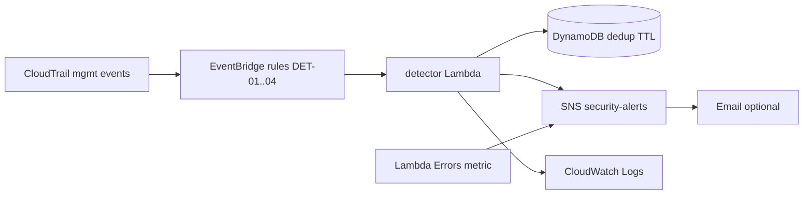

# Continuous monitoring — HIPAA drift detection

CloudTrail management events are evaluated in near real time for PHI-relevant misconfiguration. This layer complements passive audit logging (`grc_cloudtrail.tf`) with **active detection and alert routing**.

## Architecture



## Detection catalog

| ID | Trigger | HIPAA / gap | Severity |
|---|---|---|---|
| DET-01 | S3 public access block weakened/removed or anonymous bucket policy on PHI buckets | 164.312(a)(1), GAP-01/03 | HIGH |
| DET-02 | PHI CMK `DisableKey` or `ScheduleKeyDeletion` | 164.312(a)(2)(iv), GAP-01/02 | CRITICAL |
| DET-03 | Evidence vault retention or legal-hold change | 164.312(b), evidence vault | HIGH |
| DET-04 | Intake Lambda role regains `dynamodb:*` / `s3:*` | 164.312(a)(1), GAP-07 | HIGH |

Terraform resources live in [`terraform/grc_detection.tf`](../terraform/grc_detection.tf). Classification logic is in [`monitoring/detector/classify.py`](../monitoring/detector/classify.py).

## Alert routing

1. **Primary:** Amazon SNS topic `acme-health-intake-security-alerts-<suffix>` (see `terraform output security_alerts_topic_arn`).
2. **Optional email:** Set `security_alert_email` in `terraform.tfvars` (not committed). SNS sends a confirmation link; alerts are not delivered until confirmed.
3. **Pipeline health:** CloudWatch alarm on detector Lambda `Errors` also publishes to the same SNS topic.

Alert payload (JSON) includes `detection_id`, `control_id`, `gap_id`, `severity`, `summary`, and the originating CloudTrail fields.

## Noise reduction

Duplicate CloudTrail `eventID` values are suppressed for `alert_dedup_ttl_seconds` (default **3600** / 1 hour) using a DynamoDB table with TTL. Concurrent duplicates use a conditional write so only one alert is published.

## Tests

Replay fixture events (no AWS credentials required):

```bash
python -m pip install pytest
pytest monitoring/tests -v
```

Fixtures under `monitoring/tests/fixtures/` cover compliant and non-compliant CloudTrail `detail` objects.

## Deploy

Detection resources are created with the main stack:

```bash
make deploy AWS_PROFILE=capstone-deploy-user
```

Optional email subscription:

```hcl
# terraform.tfvars (local only, gitignored)
security_alert_email = "you@example.com"
```

After apply, confirm the SNS subscription from your inbox.

## Out of scope (documented gaps)

- **GAP-08** API Gateway access logs / WAF (data-plane HTTP) — still planned; CloudTrail does not see per-request intake traffic.
- **GAP-06** Lambda DLQ / X-Ray — operational resilience, not drift detection.

See [`WRITEUP.md`](../WRITEUP.md) for trade-offs.
